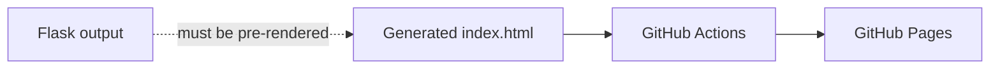

# Flask to GitHub Pages Example

 

A minimal demonstration of publishing the output of a dynamic Flask-style page as a static GitHub Pages site.

## How it works

The repository contains a generated `index.html` and a GitHub Actions workflow in `.github/workflows/static.yml`. GitHub Pages serves the static file; it does **not** run a Flask/Python server. Any dynamic Flask output must therefore be rendered to static HTML before deployment.

The workflow packages the repository's static content and deploys it through GitHub Pages whenever its configured trigger runs.

## Publishing

1. Enable GitHub Pages in the repository settings and select **GitHub Actions** as the source.
2. Push a change to the configured branch.
3. Check the Actions tab for the deployment result.

Open `index.html` directly to preview the current page locally.

## Key limitation

GitHub Pages only hosts static HTML, CSS, JavaScript, and assets. Server-side routes, databases, sessions, and other Flask runtime features require a separate hosting service.

<!-- documentation-extras -->

## Project flow

Documentation and maintenance notes

- Commands and behaviour in this README are derived from the files currently committed to the repository.
- External services, games, websites, browser APIs, and file formats can change independently of this project.
- When reporting a problem, include the operating system, runtime version, exact command, and complete error text with secrets removed.

## Contributing

Focused fixes are welcome. Before changing behaviour, open an issue describing the problem and intended result. Keep credentials, generated secrets, personal data, and machine-specific configuration out of commits. Update this README whenever commands, configuration, paths, or supported behaviour change.

## Licence

No project-level licence is currently declared in this repository. Copyright remains with the repository owner and other contributors; obtain permission before redistributing or incorporating the code elsewhere. Third-party assets and dependencies retain their own licences.
